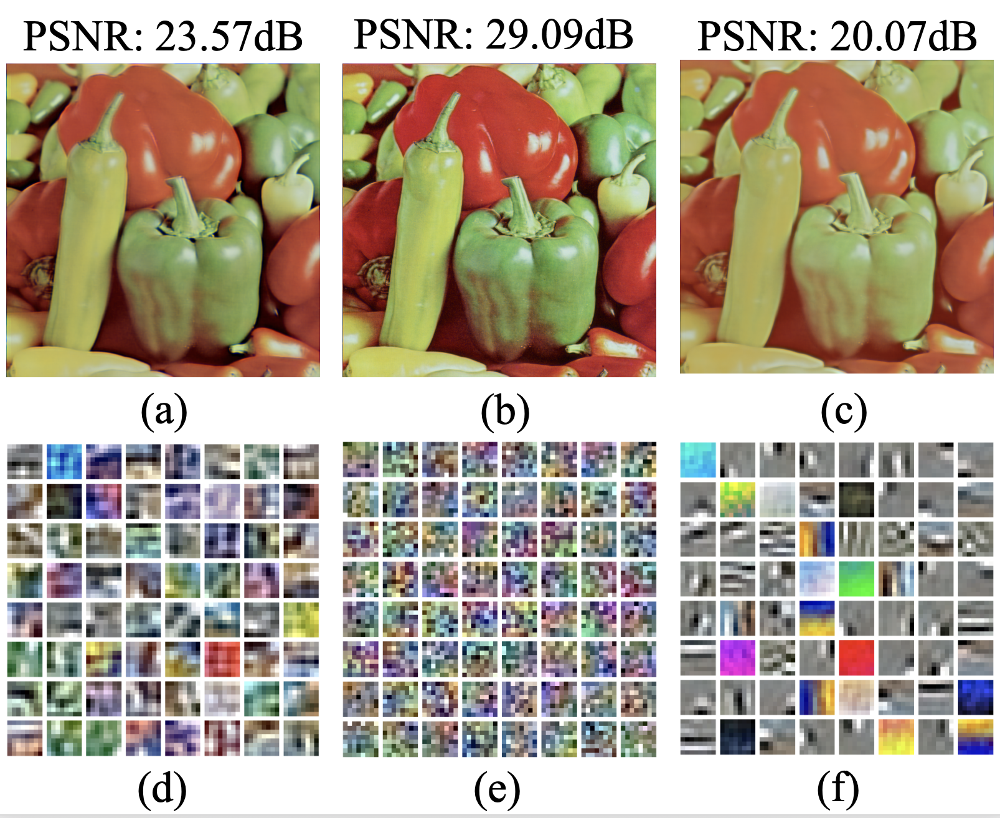
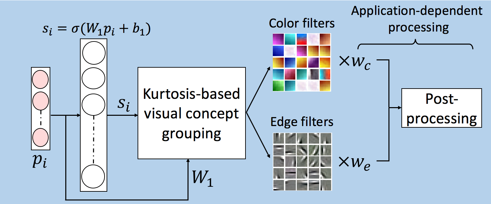

# Semantically interpretable and controllable Filter Sets
This is the MATLAB implementation of our paper:

[Mohit Prabhushankar*](https://www.linkedin.com/in/mohitps/), [Gukyeong Kwon*](https://www.linkedin.com/in/gukyeong-kwon/), and [Ghassan AlRegib](https://ghassanalregib.com), "Semantically Interpretable and Controllable Filter Sets," 2018 25th IEEE International Conference on Image Processing (ICIP), Athens, 2018, pp. 1053-1057. (*: equal contribution)\
[[IEEE](https://ieeexplore.ieee.org/document/8451220)]

## Abstract
In this paper, we generate and control semantically interpretable filters that are directly learned from natural images in an unsupervised fashion. Each semantic filter learns a visually interpretable local structure in conjunction with other filters. The significance of learning these interpretable filter sets is demonstrated on two contrasting applications. The first application is image recognition under progressive decolorization, in which recognition algorithms should be color-insensitive to achieve a robust performance. The second application is image quality assessment where objective methods should be sensitive to color degradations. In the proposed work, the sensitivity and lack thereof are controlled by weighing the semantic filters based on the local structures they represent. To validate the proposed approach, we utilize the CURE-TSR dataset for image recognition and the TID 2013 dataset for image quality assessment. We show that the proposed semantic filter set achieves state-of-the-art performances in both datasets while maintaining its robustness across progressive distortions. 

## Semantic Autoencoder
We investigate different regularization techniques including l<sub>1</sub> ((a), (d)), l<sub>2</sub>((b), (e)), and elastic net ((c), (f)) regularizations and show filters for visual concepts such as colors and edge can be explictly learned using elastic net regularization. Below are reconstructed images and learned weights of autoencoder using different regularization techniques.

<p align="center">

</p>
We demonstrate the advantage of learning semantic filters and categorizing them based on visual concepts using two applications: traffic sign recognition and image quality assessment. 
<p align="center">

<br>
General framework of the semantic autoencoder
</p> 

## Usage 
Code for both Image Quality Assessment and Traffic Sign Recognition are provided in separate folders.    
For each application, run the demo.m file. Sample original and distorted images (for IQA) and sample Traffic Sign images are provided.  
For IQA : The code outputs the quality of the distorted image which lies between 0 and 1 (1 being the best quality).  
For Traffic Sign Recognition : The code recognizes the traffic sign according to the label convention in this [paper](https://arxiv.org/abs/1712.02463)  

## Citation
If you find our paper and repository useful, please consider citing our paper:  
IEEE Link : https://ieeexplore.ieee.org/document/8451220  
```
@inproceedings{prabhushankar2018semantically,
  title={Semantically Interpretable and Controllable Filter Sets},
  author={Prabhushankar, Mohit and Kwon, Gukyeong and Temel, Dogancan and AIRegib, Ghassan},
  booktitle={2018 25th IEEE International Conference on Image Processing (ICIP),
  pages={1053--1057},
  note = {(*: equal contribution),
  year={2018},
  organization={IEEE}
}

```
